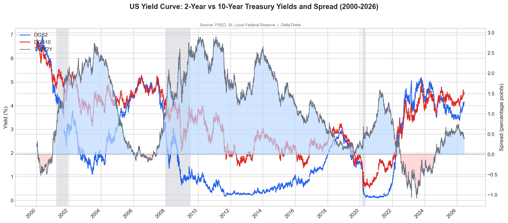

# DeltaTheta (DnT)

Institutional-grade macro research from free public data. Built in the open. Published on Substack.

→ **[Read on Substack](https://deltantheta.substack.com)**
→ **[Support the work](https://buymeacoffee.com/DeltanTheta)**

---



*US Yield Curve: 2Y vs 10Y and Spread (2000–2026) — generated by this pipeline from FRED data*

---

## What This Is

Most macro research hides the methodology. DnT shows it.

Every indicator, every chart, and every signal in the DeltaTheta research pipeline is built from
publicly available data using open-source tools. The full code is here. The reasoning behind each
design decision is documented in the posts. Nothing is behind a paywall.

The pipeline ingests data from FRED, BLS, CFTC, and market price feeds, produces
publication-quality charts, and publishes to Substack automatically. All of it is reproducible —
if you can run Python, you can run this.

## Data Sources

| Source | What We Pull |
|--------|-------------|
| [FRED](https://fred.stlouisfed.org) | Yield curves, CPI, GDP, M2, unemployment |
| [BLS](https://www.bls.gov) | Employment, payrolls, labor force participation |
| [CFTC COT](https://www.cftc.gov/MarketReports/CommitmentsofTraders) | Futures positioning — Commercial vs. Non-Commercial |
| [Yahoo Finance](https://finance.yahoo.com) | Price data, realized volatility |

All sources are free and public. No Bloomberg terminal required.

## Tools

| Script | Purpose |
|--------|---------|
| `tools/fred_fetch.py` | Fetch any FRED series to CSV |
| `tools/bls_fetch.py` | BLS employment data |
| `tools/cot_fetch.py` | CFTC COT positioning data |
| `tools/price_fetch.py` | Price and realized volatility via yfinance |
| `tools/vol_snapshot.py` | Implied/realized vol comparison table |
| `tools/chart_macro.py` | Publication-quality dual-axis charts with recession shading |
| `tools/substack_post.py` | Publish Markdown drafts to Substack via browser automation |
| `tools/medium_post.py` | Cross-post to Medium with Substack footer |
| `tools/x_post.py` | Post charts to X/Twitter |

## Architecture

The pipeline follows a **WAT** pattern — Workflows, Agents, Tools:

- **Workflows** (`workflows/`) — plain-language SOPs defining what to do and why
- **Tools** (`tools/`) — deterministic Python scripts that do the actual execution
- **Agent** — Claude reads the workflow and orchestrates the tools

Probabilistic AI handles reasoning and orchestration. Deterministic code handles execution.
The separation is what makes the output reliable.

## Quick Start

```bash
pip install pandas fredapi python-dotenv matplotlib playwright tweepy
playwright install chromium
```

Copy `.env.example` to `.env` and fill in your API keys (FRED key is free, everything else
either free-tier or not required to get started).

Pull the yield curve:
```bash
python tools/fred_fetch.py --series DGS2 DGS10 T10Y2Y T10Y3M --start 2000-01-01
```

Generate the chart:
```bash
python tools/chart_macro.py --csv .tmp/fred_DGS2_DGS10_T10Y2Y_<date>.csv \
  --left DGS2 DGS10 --right T10Y2Y --fill-zero T10Y2Y --recessions \
  --title "US Yield Curve: 2Y vs 10Y and Spread" --out .tmp/yield_curve.png
```

## Posts

The Substack documents the build. Each post covers one indicator or tool in depth —
the economic reasoning, the code, and the output.

| # | Topic |
|---|-------|
| 1 | [The Manifesto — Why This Exists](https://deltantheta.substack.com) |
| 2 | [WAT — The Framework Behind the Pipeline](https://deltantheta.substack.com) |
| 3 | [The Yield Curve — What It Measures and the Code to Pull It](https://deltantheta.substack.com) |
| 4 | Charting the Yield Curve — Building the Visualization Layer |
| 5 | COT Reports — Reading Futures Positioning |
| 6 | Employment — What the BLS Data Actually Says |
| 7 | GDP Growth — Measuring the Expansion |
| 8 | Inflation — CPI, PCE, and What the Fed Watches |
| 9 | GDP vs. Inflation — Regime Classification |
| 10 | Volatility — Implied vs. Realized |

## AI Attribution

Posts are written by Claude (Anthropic) with editorial oversight. The methodology,
data selection, and interpretation are directed by the author. All code is reviewed
before use. This is documented in every post.

---

*[DeltaTheta Substack](https://deltantheta.substack.com) · [Buy me a coffee](https://buymeacoffee.com/DeltanTheta)*
